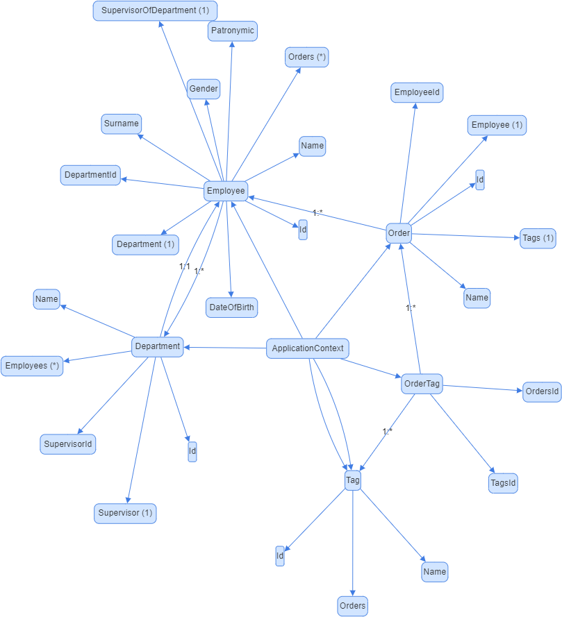

# SimpleWPF

A desktop application to perform CRUD operations on a set of entities.

## Prerequisites

- .NET SDK 6.0 
- Docker

## Build 
Once the repo is created from the terminal run:
```shell
dotnet restore
dotnet build
```

## Run
```shell
docker compose up
dotnet run --project .\src\SimpleWPF\SimpleWPF.csproj
```

## Test
```shell
dotnet test
```

## Entities Diagram
